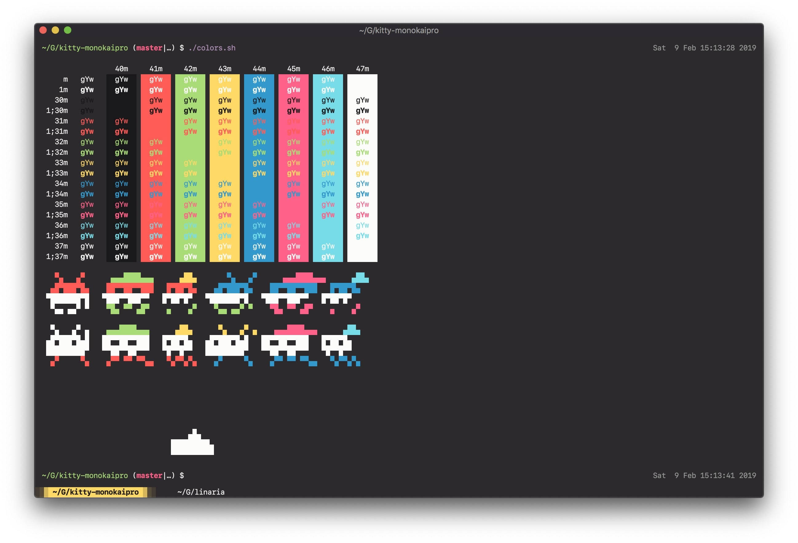

# kitty-monokaipro

> [Kitty](https://github.com/kovidgoyal/kitty) theme. Based on [Monokai Pro](https://www.monokai.pro/) by [Wimer Hazenberg](https://www.monokai.nl/).



# Install

Download this file and place it alongside your kitty config file. Place this line at the bottom of your config file:

```
# your kitty.conf
# ...

include kitty-monokaipro.conf

# Or absolute path
# include /path/to/kitty-monokaipro.conf
```

All credits to Wimer Hazenberg.
